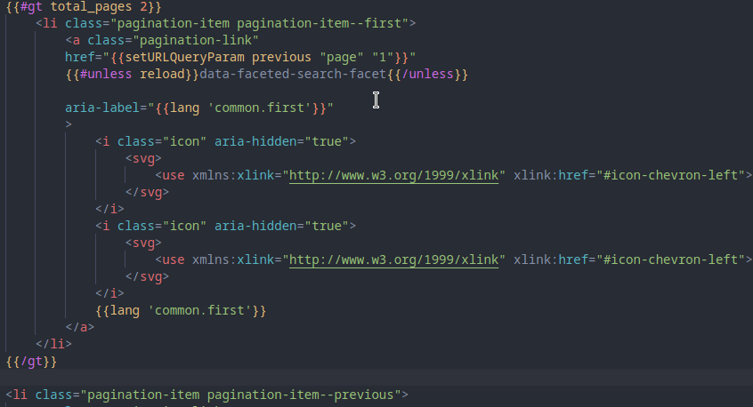

# big-commerce-handlebars README

Provides support for BigCommerce theme templates.

## Features

- Basic autocomplete (trigger on '{{' or '(')

- Hover documentation

- Linked editing

## Known Issues

Calling out known issues can help limit users opening duplicate issues against your extension.

## Release Notes

### 0.0.1

Initial release of

-----------------------------------------------------------------------------------------------------------
## Following extension guidelines

Ensure that you've read through the extensions guidelines and follow the best practices for creating your extension.

* [Extension Guidelines](https://code.visualstudio.com/api/references/extension-guidelines)

## Working with Markdown

**Note:** You can author your README using Visual Studio Code.  Here are some useful editor keyboard shortcuts:

* Split the editor (`Cmd+\` on macOS or `Ctrl+\` on Windows and Linux)
* Toggle preview (`Shift+CMD+V` on macOS or `Shift+Ctrl+V` on Windows and Linux)
* Press `Ctrl+Space` (Windows, Linux) or `Cmd+Space` (macOS) to see a list of Markdown snippets

### For more information

* [Visual Studio Code's Markdown Support](http://code.visualstudio.com/docs/languages/markdown)
* [Markdown Syntax Reference](https://help.github.com/articles/markdown-basics/)

**Enjoy!**
